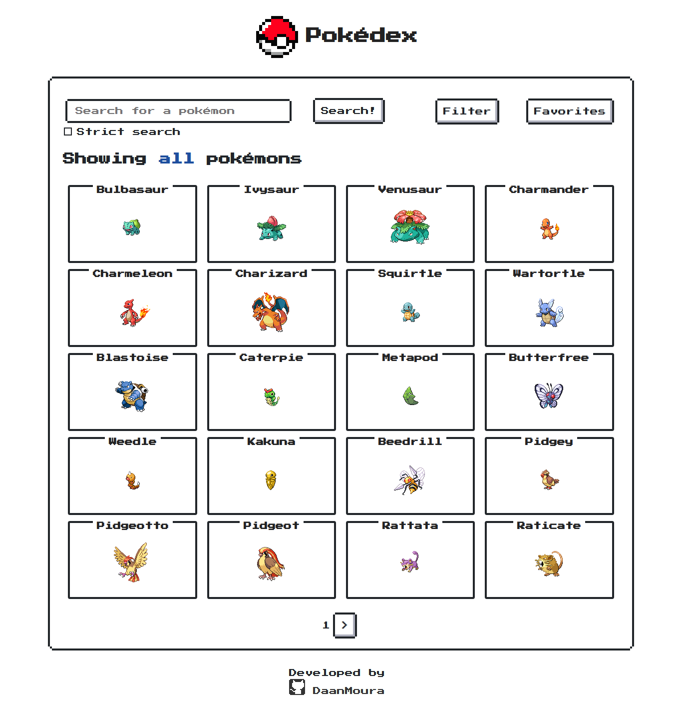

# React Pokédex

A Pokédex website made in React (with a nice retro look).
All information is given from [PokéAPI]()


> Esse projeto é um teste do processo seletivo da Birdie

## Getting Started

Make sure you have [npm](https://www.npmjs.com/get-npm) or [yarn](https://yarnpkg.com/en/docs/getting-started) installed and follow these simple steps!

1. Clone the repo and change to the project directory
	```
	git clone https://github.com/DaanMoura/pokedex
	cd pokedex
	```
2. Install packages dependencies
	
	```
	npm install
	```
	or
	```
	yarn install
	```
3. Run!
	```
	npm start
	```
	or
	```
	yarn start
	```
Open  [http://localhost:3000](http://localhost:3000/)  to view it in the browser.

The page will reload if you make edits.  
You will also see any lint errors in the console.


## Screenshot


